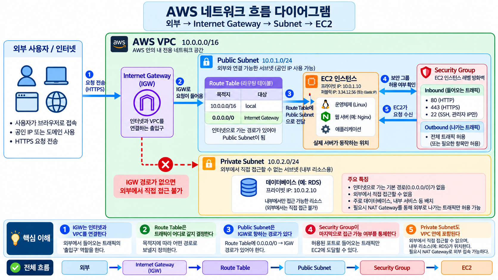

# 🟩 AWS 클라우드 배포 웹 인프라 프로젝트  

AWS(Amazon Web Services)에 전용 네트워크와 가상 서버를 구성하고, Nginx 웹 서버를 인터넷에서 접속할 수 있게 만드는 실습 프로젝트다. 네트워크 생성, 접근 제어, 웹 응답 확인, 장애 원인 분석, 리소스 삭제까지 직접 수행한다.  

AWS 리소스는 Mac의 AWS CLI(Command Line Interface, 명령줄 인터페이스)로 관리한다. 서버 안의 Nginx 설치와 상태 확인은 SSH(Secure Shell, 암호화 원격 접속)로 연결한 Ubuntu Terminal에서 수행한다.  

<br><br>

## 🟢 네트워크 구조  

  

그림은 인터넷 요청이 EC2까지 도달하는 흐름과 Public Subnet·Private Subnet의 차이를 설명한다. 그림 속 Public IP는 설명용 예시다.  

기본 실습은 Public Subnet 한 개, EC2 한 대, Nginx, HTTP 80번 Port로 구성한다. 그림의 HTTPS 443, Private Subnet, RDS(Relational Database Service), NAT(Network Address Translation) Gateway는 확장 구성을 이해하기 위한 예시이며 기본 실습에서는 생성하지 않는다.  

| 구성요소 | 풀네임·뜻 | 역할 |  
| :--- | :--- | :--- |
| VPC | Virtual Private Cloud, 전용 가상 네트워크 | `10.0.0.0/16` 범위의 실습 네트워크 구성 |  
| Public Subnet | 인터넷 방향 경로가 있는 네트워크 구역 | `10.0.1.0/24` 범위에 EC2 배치 |  
| IGW | Internet Gateway, 인터넷 출입구 | VPC와 인터넷 연결 |  
| Route Table | 라우팅 테이블, 목적지별 경로표 | 내부 통신은 `local`, 인터넷 방향은 `0.0.0.0/0 → IGW`로 전달 |  
| Security Group | 리소스의 통신을 제어하는 가상 방화벽 | HTTP와 관리자 SSH에 필요한 통신 허용 |  
| EC2 | Elastic Compute Cloud, 가상 서버 | Ubuntu와 Nginx 실행 |  
| EBS | Elastic Block Store, 서버의 저장장치 | 운영체제와 웹 파일 저장 |  
| IAM | Identity and Access Management, 사용자·권한 관리 | AWS 리소스를 관리하는 작업의 권한 제한 |  

Route Table은 별도의 서버가 아니라 경로를 결정하는 설정이다. 외부 요청과 응답이 오가려면 IGW 경로, EC2 Public IPv4, Security Group 허용 규칙, 실행 중인 웹 서버가 함께 필요하다.  

<br><br>

## 🟢 실습 환경  

| 항목 | 기본 구성 |  
| :--- | :--- |
| 작업 환경 | macOS, MacBook M1 Pro |  
| Region | 서울 `ap-northeast-2` |  
| AWS CLI Profile | `aws-basic` 또는 직접 설정한 Profile |  
| Project Tag | `Project=aws-basic-lab` |  
| EC2 | `t3.micro` 한 대 |  
| 운영체제 | Ubuntu 24.04 LTS(Long Term Support, 장기 지원), x86_64 |  
| 저장장치 | 암호화된 `gp3` EBS 8 GiB, EC2 종료 시 Root Volume 삭제 설정 |  
| 웹 서버 | Nginx |  
| 접속 확인 | `GET /health` |  

Mac은 원격 명령을 보내고, Ubuntu와 Nginx는 EC2에서 실행한다. 따라서 Mac과 EC2의 CPU 구조가 달라도 실습할 수 있다.  

<br><br>

## 🟢 실습 진행 순서  

AWS CLI 설치와 IAM 인증 연결을 마친 뒤 아래 문서를 번호순으로 진행한다. 각 문서에는 실행 명령과 주요 Option의 의미가 함께 들어 있다.  

| 순서 | 문서 | 내용 |  
| :---: | :--- | :--- |
| 1 | [AWS CLI 실습 1](AWS/01_AWS_CLI_Practice.md) | 인증·Region 확인, 공통 변수, 중복 검사, AZ(Availability Zone, 가용 영역) 선택 |  
| 2 | [AWS CLI 실습 2](AWS/02_AWS_CLI_Practice.md) | VPC, Subnet, IGW, Route Table 생성과 연결 |  
| 3 | [AWS CLI 실습 3](AWS/03_AWS_CLI_Practice.md) | 내 IP, Security Group, SSH Key Pair, AMI(Amazon Machine Image), EC2 생성 |  
| 4 | [AWS CLI 실습 4](AWS/04_AWS_CLI_Practice.md) | SSH 접속, Nginx 설치, 내부·외부 검증, 장애 재현과 복구 |  
| 5 | [AWS CLI 실습 5](AWS/05_AWS_CLI_Practice.md) | 리소스 삭제, 삭제 최종 조회, 공통 문법과 완료 기준 |  

여러 줄 명령을 복사할 때 줄 끝의 역슬래시(`\`) 뒤에 공백이 없어야 한다. 문서의 한 줄 버전을 선택해도 된다. 같은 작업의 두 버전을 모두 실행하면 리소스가 중복 생성될 수 있으므로 하나만 사용한다.  

새 Terminal을 열면 Shell 변수를 다시 설정한다. 기존 Resource ID는 실습 4의 ID 복구 절차로 조회한다.  

<br><br>

## 🟢 웹 서비스 외부 접속 확인  

검증 방식은 B인 `GET http://<Public-IP>/health` 호출이다. Nginx가 `/var/www/html/health` 파일의 고정 문자열 `OK`를 제공한다.  

| 실행 위치 | 요청 주소 | 정상 판정 |  
| :--- | :--- | :--- |
| EC2 내부 | `http://localhost/health` | HTTP Status `200 OK`, 응답 본문 `OK` |  
| Mac 외부 | `http://<Public-IP>/health` | HTTP Status `200 OK`, 응답 본문 `OK` |  

실습에서 `PUBLIC_IP` 변수를 설정한 뒤 Mac에서 실행한다.  

```bash
# curl은 URL로 데이터를 주고받는다. 5초 동안 연결을 기다리고 응답 Header와 Body를 표시한다.  
curl --connect-timeout 5 -i "http://${PUBLIC_IP}/health"  
```

| 명령·Option | 의미 |  
| :--- | :--- |
| `curl` | Client for URLs, URL로 데이터를 주고받는 도구 |  
| `--connect-timeout 5` | 연결 대기 시간을 최대 5초로 제한 |  
| `-i` | 응답 Header와 Body를 함께 표시 |  
| `${PUBLIC_IP}` | 앞 단계에서 조회한 EC2 Public IPv4 사용 |  

현재 저장소에서는 실제 외부 응답 스크린샷을 확인하지 못했다. 실습 완료 후 실제 접속 URL, 확인 시각, `200 OK`와 `OK`가 보이는 Terminal 스크린샷을 이 항목에 추가한다. 리소스를 삭제한 뒤에는 해당 URL로 접속할 수 없다.  

<br><br>

## 🟢 접근 제어와 보안  

| 구분 | 적용 기준 |  
| :--- | :--- |
| HTTP 80 | 모든 IPv4 주소인 `0.0.0.0/0`에서 웹 접속 허용 |  
| SSH 22 | 현재 관리자 Public IPv4 `/32` 한 개만 허용 |  
| 다른 Inbound Port | 기본 실습에서 허용하지 않음 |  
| IAM | EC2와 네트워크 구성에 필요한 권한으로 제한, `AdministratorAccess` 사용 금지 |  
| 인증정보 | `.env`, Credentials, Access Key, Secret Access Key, Private Key를 공개 문서·Git에 저장하지 않음 |  

Security Group은 서버의 Network 통신을 제어하고 IAM은 사용자가 AWS API로 수행할 수 있는 작업을 제어한다. SSH를 모든 IP에 열거나 전체 Port 범위를 허용하지 않는다.  

<br><br>

## 🟢 문제 해결  

[트러블슈팅 보고서](AWS/troubleshooting.md)는 SSH 접속 실패와 외부 HTTP 접속 실패의 증상, 가설, 검증, 조치, 결과, 재발 방지를 정리한다.  

외부 접속이 실패하면 다음 순서로 원인을 좁힌다.  

1. IGW 연결, Route Table 기본 경로, Subnet 연결  
2. Security Group의 HTTP Port와 Source  
3. EC2의 현재 Public IP와 호출 주소  
4. Nginx 실행 상태, Listening Port, 내부 응답과 Log  

실습 4에는 Nginx를 잠시 중지한 뒤 상태와 Log를 확인하고 다시 시작하는 장애 재현 절차가 있다. 변경 전후 같은 요청을 비교해 원인을 설명한다.  

<br><br>

## 🟢 리소스 정리  

[리소스 정리 체크리스트](AWS/cleanup-checklist.md)와 [실습 5의 삭제 절차](AWS/05_AWS_CLI_Practice.md)에 따라 Resource ID와 Project Tag를 확인하고 정리한다.  

- EC2 영구 종료 후 남은 EBS Volume을 조회한다.  
- Security Group, Route Table 연결과 경로를 정리한다.  
- IGW를 분리·삭제하고 Subnet, Key Pair, VPC를 삭제한다.  
- Elastic IP를 조회해 이번 실습 소유의 주소가 남지 않았는지 확인한다. 기본 실습에서는 Elastic IP를 생성하지 않는다.  
- 리소스 목록과 비용 내역을 최종 확인한다.  

체크리스트에는 완료 표시가 있지만, 이 README 작성 과정에서는 실제 AWS 상태를 조회하지 않았다. 최종 완료 여부는 실습에서 저장한 조회 결과와 대조한다.  
