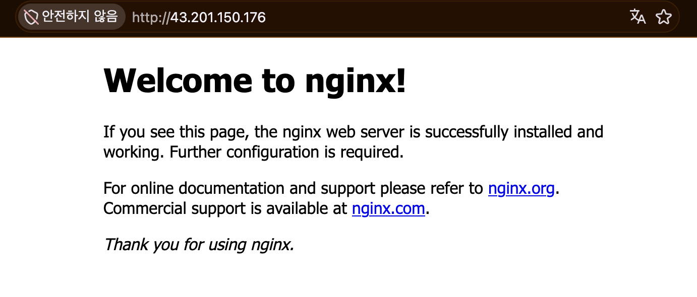
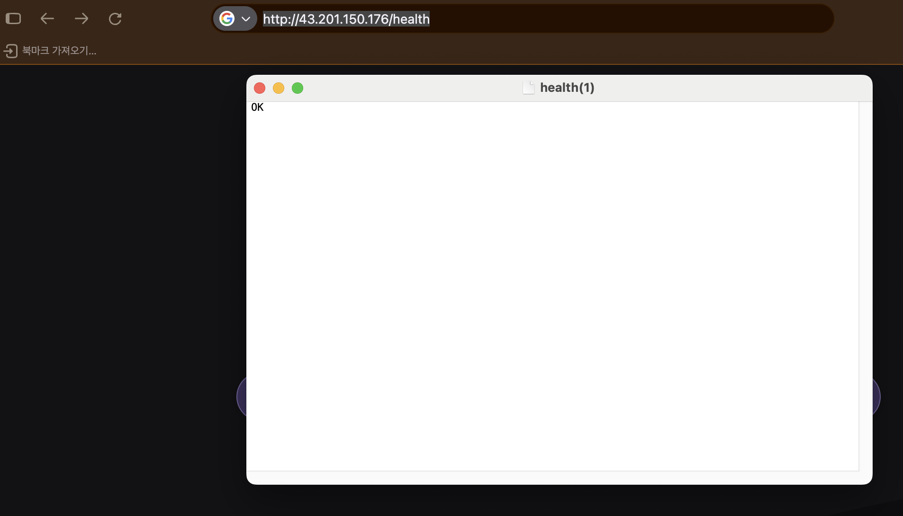

# 🟩 AWS 클라우드 배포 웹 인프라 프로젝트

<br><br>

## 🟢 목차

- [프로젝트 폴더 구조](#-프로젝트-폴더-구조)
- [프로젝트 소개](#-프로젝트-소개)
- [기존 방식: AWS CLI 수동 실습](#-기존-방식-aws-cli-수동-실습)
    - [실제 AWS 결과](#-기존-수동-실습의-실제-aws-결과)
    - [네트워크 아키텍처](#-네트워크-아키텍처)
    - [환경과 리소스 관리 기준](#-환경과-리소스-관리-기준)
    - [외부 접속 검증 결과](#-외부-접속-검증-결과)
    - [접근 제어와 IAM](#-접근-제어와-iam)
    - [장애 재현과 복구](#-장애-재현과-복구)
    - [리소스 정리](#-리소스-정리와-삭제-중-문제-해결)
    - [재현 순서와 문서 안내](#-기존-수동-실습-재현-순서와-문서-안내)
    - [배운 내용과 확장 방향](#-배운-내용과-확장-방향)
- [고도화 방식: Docker 기반 실습](#-고도화-방식-docker-기반-실습)
    - [관련 문서와 학습 순서](#-관련-문서와-학습-순서)
    - [Docker 고도화 빠른 시작](#-docker-고도화-빠른-시작)
    - [최초 준비와 환경 확인](#-최초-준비와-환경-확인)
    - [공식 Cross-platform 명령](#-공식-cross-platform-명령)
    - [고도화 검증 결과와 범위](#-고도화-검증-결과와-범위)

<br><br>

## 🟢 프로젝트 폴더 구조

```text
learn_aws/
├── README.md                        # 전체 프로젝트와 시작 위치 안내
├── docs/                            # 기존 과제 요구사항
├── AWS/                             # 수동 실습·실제 AWS 증빙·정리 기록
├── AWS_advanced/                    # Docker 기반 고도화 도구
│   ├── README_Docker_Enhanced.md     # 상세 사용 설명서
│   ├── 고도화.md                    # 구조와 구현 계획
│   ├── Dockerfile                   # Ubuntu 실행 이미지 제작
│   ├── compose.yaml                 # 공통 aws-lab 서비스
│   ├── aws-lab / aws-lab.ps1         # Bash·PowerShell 편의 Wrapper
│   ├── config/                      # 설정 예시와 사용자별 인증 준비 위치
│   ├── scripts/                     # 공통 함수·명령·단계별 작업
│   ├── runtime/                     # 개인키·상태 저장, Git·이미지 제외
│   ├── docs/                        # 고도화 IAM 작업 설명
│   └── tests/                       # 모의 응답·오프라인 검증
├── _practice/                       # 로컬 단계별 학습 문서
└── _record/                         # 로컬 작업 기록
```

사용자 설정·AWS 인증파일·개인키·runtime은 공개하지 않는다. 인증정보는 이미지에 넣지 않고 실습 전용 폴더만 읽기 전용으로 연결한다.

<br><br>

## 🟢 프로젝트 소개

AWS(Amazon Web Services)에 전용 네트워크와 EC2 가상 서버를 구축하고, Nginx 웹 서버의 외부 접속을 배우는 프로젝트다. 기존 수동 AWS CLI 실습과 Ubuntu Docker 컨테이너에서 같은 작업을 실행하는 고도화 도구를 함께 제공한다. CLI는 Command Line Interface다.

기존 수동 실습은 2026년 10월 1일의 실제 AWS 실행 Log와 화면 자료를 기준으로 정리했다. 실습 종료 후 리소스를 정리했으므로 아래 접속 주소는 당시 검증 기록이다. Docker 고도화는 로컬 이미지와 모의 응답으로 검증했으며, 실제 AWS 생성·접속·삭제 성공을 확인한 결과와 구분한다.

<br><br>

## 🟢 기존 방식: AWS CLI 수동 실습

### 🟡 기존 수동 실습의 실제 AWS 결과

| 항목 | 구현 및 검증 결과 | 근거 자료 |  
| :--- | :--- | :--- |
| 네트워크 | VPC, Public Subnet, IGW, 기본 Route, Subnet 연결 구성 | [AWS 구성 증빙](AWS/01_AWS_practice/07_AWS_구성_증빙.md) |  
| 서버 | Ubuntu EC2 한 대, Nginx 실행 상태 확인 | [서버 배포 실습](AWS/01_AWS_practice/04_AWS_CLI_Practice.md) |  
| 접근 제어 | HTTP 80 공개, SSH 22는 관리자 IP 하나로 제한 | [AWS 구성 증빙](AWS/01_AWS_practice/07_AWS_구성_증빙.md) |  
| 외부 접속 | HTTP `200 OK`, 고정 응답 `OK`, Nginx 페이지 표시 | [Health Check 기록](AWS/05_health_check/AWS_Health_Check.md) |  
| 장애 대응 | Nginx 중지 원인 확인 후 재시작, 내부·외부 응답 복구 | [트러블슈팅 보고서](AWS/06_troubleshooting/troubleshooting.md) |  
| 리소스 정리 | EC2 종료, EBS 잔여 확인, 네트워크·Key Pair 삭제 기록 | [정리 체크리스트와 실행 Log](AWS/07_AWS_cleanup/00_cleanup-checklist.md) |  

<br><br>

### 🟡 네트워크 아키텍처

  

그림은 인터넷과 AWS 네트워크의 연결, Public Subnet과 Private Subnet의 차이를 설명한다. 그림 속 주소는 개념 설명용 예시다.  

실제 기본 구성은 Public Subnet 한 개, EC2 한 대, HTTP 80번 Port의 Nginx다. 그림의 HTTPS 443, Private Subnet, RDS(Relational Database Service), NAT(Network Address Translation) Gateway는 확장 예시다.  

| 구성요소 | 풀네임·뜻 | 실제 역할 |  
| :--- | :--- | :--- |
| VPC | Virtual Private Cloud, 전용 가상 네트워크 | `10.0.0.0/16` 범위의 실습 네트워크 |  
| Public Subnet | 인터넷 방향 경로가 있는 네트워크 구역 | `10.0.1.0/24`, 서울 AZ에 EC2 배치 |  
| IGW | Internet Gateway, 인터넷 출입구 | VPC와 인터넷 연결 |  
| Route Table | 목적지별 경로표 | 내부는 `local`, 외부 IPv4는 `0.0.0.0/0 → IGW` |  
| Security Group | 리소스의 가상 방화벽 | HTTP와 관리자 SSH 통신 허용 |  
| EC2 | Elastic Compute Cloud, 가상 서버 | Ubuntu와 Nginx 실행 |  
| EBS | Elastic Block Store, 블록 저장장치 | 운영체제와 웹 파일 저장 |  
| IAM | Identity and Access Management, 사용자·권한 관리 | AWS API 관리 작업의 권한 제어 |  

Route Table은 별도의 서버가 아니라 경로 설정이다. 외부 통신에는 IGW 경로, EC2 Public IPv4, Security Group 허용 규칙, 실행 중인 웹 서버가 함께 필요하다.  

<br><br>

### 🟡 환경과 리소스 관리 기준

| 항목 | 구성 |  
| :--- | :--- |
| 작업 환경 | macOS |  
| 관리 도구 | AWS CLI(Command Line Interface), SSH(Secure Shell) |  
| Region / AZ | 서울 `ap-northeast-2` / `ap-northeast-2a` |  
| EC2 | `t3.micro` 한 대 |  
| 운영체제 | Ubuntu 24.04 LTS(Long Term Support), x86_64 |  
| 저장장치 설정 | 암호화된 `gp3` EBS 8 GiB, Root Volume 종료 시 삭제 |  
| 웹 서버 | Nginx, 응답 기록의 버전 `1.24.0` |  
| Project Tag | `Project=aws-basic-lab` |  
| 이름 규칙 | `aws-basic-lab-vpc`, `aws-basic-lab-subnet` 등 |  

[Tag와 이름 규칙](AWS/01_AWS_practice/00_tag_and_naming_rules.md)으로 리소스를 묶어 조회하고 삭제 대상을 추적했다. Mac은 원격 명령을 보내며 Ubuntu와 Nginx는 EC2에서 실행하므로 두 컴퓨터의 CPU 구조가 달라도 된다.  

<br><br>

### 🟡 외부 접속 검증 결과

검증 방식은 B인 `GET /health` 호출이다. EC2의 `/var/www/html/health` 파일에 고정 문자열 `OK`를 기록하고 Nginx로 제공했다.  

| 확인 항목 | 실제 기록 |  
| :--- | :--- |
| 당시 접속 URL | `http://43.201.150.176/health` |  
| 외부 TCP 80 연결 | `succeeded!` |  
| HTTP Status / Body | `200 OK` / `OK` |  
| 응답 기록 시각 | 2026-10-01 19:52:55 KST, Header의 10:52:55 GMT를 변환 |  
| 브라우저 확인 | Nginx 기본 페이지와 Health 파일의 `OK` 확인 |  

#### ⚫️ Nginx 페이지

  

#### ⚫️ Health 응답

  

Health 화면은 브라우저에서 받은 파일의 `OK`를 보여준다. HTTP Status는 [Health Check 실행 Log](AWS/05_health_check/AWS_Health_Check.md)의 `curl` 출력으로 확인한다.  

재실습 시 Public IP 변수를 설정한 Mac Terminal에서 다음 명령을 실행한다.  

```bash
# curl은 URL로 데이터를 주고받는다. 연결을 최대 5초 기다리고 응답 Header와 Body를 표시한다.  
curl --connect-timeout 5 -i "http://${PUBLIC_IP}/health"  
```

| 명령·Option | 의미 |  
| :--- | :--- |
| `curl` | Client for URLs, URL로 데이터를 주고받는 도구 |  
| `--connect-timeout 5` | 연결 대기 시간을 최대 5초로 제한 |  
| `-i` | 응답 Header와 Body를 함께 표시 |  
| `${PUBLIC_IP}` | 재실습에서 조회한 EC2 Public IPv4 사용 |  

<br><br>

### 🟡 접근 제어와 IAM

| 대상 | 적용 기준 |  
| :--- | :--- |
| HTTP 80 | `0.0.0.0/0`에서 웹 접속 허용 |  
| SSH 22 | 관리자 Public IPv4 `/32` 한 개만 허용 |  
| 기타 Inbound Port | 구성 증빙의 규칙 목록에 없음 |  
| IAM Policy | EC2·VPC 관리 작업과 인증 관리 Action을 열거 |  
| 인증정보 | Access Key, Secret Access Key, Private Key, `.env`를 공개 자료에 넣지 않음 |  

Security Group은 Network 통신을, IAM은 AWS API 작업 권한을 제어한다. [IAM Policy 문서](AWS/02_IAM_Policy/AWS_IAM_Policy.md)의 정책에는 `ec2:Describe*`, `Resource: "*"`, IAM 인증 관리 권한이 포함되어 있다. 따라서 작업 종류를 제한한 실습용 정책이며, 리소스·사용자 범위까지 세밀하게 제한한 운영용 최소 권한 정책으로 해석하면 안 된다.  

운영 환경에서는 실제 사용하는 Action, Resource, 조건을 기준으로 범위를 더 좁힌다. 원본 정책의 `Version` 표기는 `2012-10-10`이므로 그대로 복사하기 전에 IAM 정책 언어 버전 `2012-10-17`로 확인해야 한다.  

<br><br>

### 🟡 장애 재현과 복구

Nginx 중지로 발생한 장애를 증상 → 가설 → 검증 → 조치 → 결과 → 재발 방지 순서로 기록했다.  

| 단계 | 실제 기록 |  
| :--- | :--- |
| 증상 | 내부·외부 `/health` 요청 연결 실패 |  
| 가설 | Network 설정 문제 또는 Nginx Process 중지 |  
| 검증 | 내부 요청 실패, `systemctl status`의 `inactive (dead)` |  
| 조치 | Nginx Service 시작 |  
| 결과 | `active (running)`, 내부·외부 `200 OK`와 `OK` |  
| Log 근거 | 11:05:11 UTC 중지, 11:08:03 UTC 시작 기록 |  
| 재발 방지 | 배포 후 Process 상태와 Health 응답 동시 검사, 자동 재시작 설정 검토 |  

`curl` 오류 번호만으로 모든 Network 설정이 정상이라고 단정하지 않는다. 이 사례에서는 localhost 실패, Process 상태, 재시작 후 성공을 함께 확인해 원인을 좁혔다. 자동 검사와 자동 재시작은 기존 보고서의 개선 제안이다. Docker 고도화 도구의 health 검사는 구현했지만, 상시 모니터링과 장애 후 자동 재시작 기능을 구현한 것은 아니다.

상세 명령과 출력은 [트러블슈팅 보고서](AWS/06_troubleshooting/troubleshooting.md)에 있다.  

<br><br>

### 🟡 리소스 정리와 삭제 중 문제 해결

[정리 체크리스트](AWS/07_AWS_cleanup/00_cleanup-checklist.md)에 삭제 명령, 실행 Log, 최종 조회 기준을 남겼다.  

| 대상 | 정리 근거 |  
| :--- | :--- |
| EC2 | 종료 요청 후 `wait instance-terminated` 완료 기록 |  
| EBS | 종료 후 Volume 조회가 비어 있고, Console 화면에서도 Volume 없음 |  
| Security Group | 삭제 성공 응답과 삭제 화면 |  
| Route Table | 연결 해제, 기본 Route 삭제, 사용자 Route Table 삭제 |  
| IGW / Subnet / VPC | 분리·삭제 명령과 확인 화면 |  
| Key Pair | AWS Key Pair 삭제 성공, 로컬 Private Key 제거 기록 |  
| Elastic IP | 기본 실습에서 생성하지 않음, 체크리스트의 잔여 조회 항목으로 확인 |  

VPC 삭제 과정에서 `DependencyViolation`이 발생했다. 남은 사용자 Route Table을 삭제한 뒤 VPC 삭제를 재실행해 해결했다. 생성의 역순으로 연결과 의존 리소스를 정리해야 하는 이유를 실제 오류로 확인했다.  

EBS 조회 결과가 비어 있는 상황에서는 추가 Volume 삭제가 필요하지 않다. 실행 Log의 `<확인한_PROJECT_VOLUME_ID>`는 실제 ID로 바꿔야 하는 자리 표시자이며, 그대로 실행한 Shell 오류는 EBS 삭제 실패 증빙으로 해석하지 않는다.  

[리소스 정리 화면 모음](AWS/07_AWS_cleanup/)에서 단계별 자료를 볼 수 있다. EC2 화면은 종료 진행 중 장면이므로 종료 완료 근거는 CLI 대기 완료 기록과 함께 읽는다. Billing 비용 0원 여부는 별도 비용 자료가 없어 이 결과에 포함하지 않는다.  

<br><br>

### 🟡 기존 수동 실습 재현 순서와 문서 안내

AWS CLI 설치와 IAM 인증 연결을 마친 뒤 실습 문서를 번호순으로 진행한다.  

| 순서 | 문서 | 내용 |  
| :---: | :--- | :--- |
| 1 | [실습 1](AWS/01_AWS_practice/01_AWS_CLI_Practice.md) | 인증·Region, 변수, 중복 검사, AZ 선택 |  
| 2 | [실습 2](AWS/01_AWS_practice/02_AWS_CLI_Practice.md) | VPC, Subnet, IGW, Route Table |  
| 3 | [실습 3](AWS/01_AWS_practice/03_AWS_CLI_Practice.md) | Security Group, Key Pair, AMI, EC2 |  
| 4 | [실습 4](AWS/01_AWS_practice/04_AWS_CLI_Practice.md) | SSH, Nginx, Health 검증, 장애 복구 |  
| 5 | [실습 5](AWS/01_AWS_practice/05_AWS_CLI_Practice.md) | 리소스 삭제와 최종 조회 |  
| 참고 | [명령어 모음](AWS/01_AWS_practice/06_AWS_CLI_명령어_모음.md) | 명령과 Option의 의미 |  
| 참고 | [CIDR와 /32](AWS/01_AWS_practice/03_CIDR_set_32bit.md) | IP 범위와 SSH Source 제한 |  
| 참고 | [요구사항](docs/requirement.md) | 기본 구성과 선택 확장 범위 |  

같은 작업의 여러 줄·한 줄 버전 중 하나만 실행한다. 여러 줄 명령의 역슬래시 뒤에는 공백을 넣지 않는다. 새 Terminal에서는 변수를 다시 설정하고 기존 Resource ID를 조회한다.  

<br><br>

### 🟡 배운 내용과 확장 방향

- VPC와 Subnet으로 Network를 구분하고 Route Table과 IGW로 인터넷 경로를 만든다.  
- Security Group과 IAM의 책임을 구분하고 필요한 접근만 허용한다.  
- 내부 응답과 외부 응답을 비교해 서버와 Network 문제를 좁힌다.  
- Process 상태와 Log를 근거로 장애 원인을 검증한다.  
- Tag와 이름으로 리소스를 추적하고 의존 관계를 해제해 정리한다.  

HTTPS, EC2 안에서 Docker 컨테이너로 웹 서비스를 배포하기, Private Subnet의 DB, ALB(Application Load Balancer)를 통한 다중 서버 구성은 추가 확장 방향이다. 기존 실제 결과는 Nginx 직접 설치와 HTTP 접속을 기준으로 한다. AWS_advanced의 Docker는 로컬 AWS 관리 도구를 실행하는 환경이며, EC2 안에서 웹 서비스를 컨테이너로 배포하는 확장 과제와 구분한다.

<br><br>

## 🟢 고도화 방식: Docker 기반 실습

### 🟡 관련 문서와 학습 순서

| 목적 | 시작 문서 | 내용 |
| :--- | :--- | :--- |
| AWS 명령을 직접 배우기 | [수동 실습 1](AWS/01_AWS_practice/01_AWS_CLI_Practice.md) | 단계별 AWS CLI 명령과 실제 실행 기록 |
| Docker 고도화 도구 사용하기 | [고도화 사용 설명서](AWS_advanced/README_Docker_Enhanced.md) | 설정·인증 준비, 명령, 실패 복구 |
| 고도화 구조 이해하기 | [고도화 계획](AWS_advanced/고도화.md) | 실행 구조와 리소스 관리 기준 |
| 검증 범위 확인하기 | [고도화 검증 기록](AWS_advanced/tests/VALIDATION.md) | 로컬 검증 결과와 미검증 환경 |
| IAM 권한 검토하기 | [고도화 IAM 작업 목록](AWS_advanced/docs/iam-actions.md) | 생성·조회·정리에 필요한 작업 |

학습 문서는 로컬 `_practice/`에서 20 → 22 → 24 → 26 → 28 → 30번 AWS 고도화 문서 순서로 읽는다. 이미지와 컨테이너를 직접 실행하는 실습부터 시작하고, Dockerfile·Compose·Wrapper는 마지막에 직접 구축한다. `_practice/`와 `_record/`는 현재 Git 제외 대상이므로 저장소를 새로 복제하면 포함되지 않을 수 있다.

<br><br>

### 🟡 Docker 고도화 빠른 시작

#### ⚫️ 최초 준비와 환경 확인

Docker의 Linux 컨테이너 실행 환경을 준비하고, [고도화 사용 설명서](AWS_advanced/README_Docker_Enhanced.md)의 최초 준비 순서를 따른다. `config/aws`와 `runtime` 폴더를 만들고, 실제 AWS 명령을 실행하려면 `config/aws-basic-lab.env`와 실습 전용 인증 프로필도 직접 준비한다. 설정·인증값은 README나 채팅에 붙여넣지 않는다.

다음은 저장소 루트에서 시작하는 Bash 명령이다. Docker CLI 명령은 PowerShell/CMD에서도 사용하며, CMD에서는 `#` 뒤의 설명을 제외하고 명령만 입력한다.

```bash
cd AWS_advanced # change directory: 고도화 폴더로 이동한다.
docker --version # Docker CLI 설치 여부와 버전을 확인한다.
docker compose version # 공통 서비스 실행 도구인 Compose의 버전을 확인한다.
docker info # Docker 엔진의 실행과 연결 상태를 확인한다. AWS 요청은 없다.
docker compose build aws-lab # Ubuntu 도구 이미지를 만든다. AWS 리소스는 생성하지 않는다.
docker compose run --rm aws-lab help # AWS 인증 없이 사용법을 확인한다. 연결할 두 폴더는 먼저 준비한다.
docker compose run --rm aws-lab status # 실제 인증 계정·리전과 현재 실습 리소스를 읽기 전용으로 확인한다.
```

| 명령 요소 | 의미 |
| :--- | :--- |
| `compose` | Compose 설정에 정의한 서비스 사용 |
| `build` | Dockerfile로 실행 이미지 제작 |
| `run` | 서비스 설정으로 일회성 컨테이너 실행 |
| `--rm` | remove, 종료한 컨테이너 자동 제거 |
| `aws-lab` | 모든 OS와 Wrapper가 사용하는 서비스 이름 |
| `help` | AWS 호출 없이 사용법 표시 |
| `status` | 필수 도구·설정·인증과 현재 AWS 리소스 조회 |

AMI는 Amazon Machine Image, CPU는 Central Processing Unit, JSON은 JavaScript Object Notation이다. 현재 전용 `check` 명령은 없다. AMI·CPU·네트워크 생성 설정을 검사하는 단계는 `up` 안에 있으며, 검사 후 실제 리소스를 생성한다. 환경 확인만 하려고 `up`을 실행하지 않는다.

#### ⚫️ 공식 Cross-platform 명령

```bash
docker compose run --rm aws-lab up # 실제 AWS 리소스와 Nginx를 준비하고 웹 응답을 확인한다.
docker compose run --rm aws-lab status # 현재 AWS 리소스를 조회한다.
docker compose run --rm aws-lab health # EC2 내부와 외부의 HTTP 200·OK를 검사한다.
docker compose run --rm aws-lab ssh # Ubuntu EC2에 Secure Shell로 접속한다.
docker compose run --rm aws-lab down # 삭제 목록 확인 후 DELETE 입력으로 실제 AWS 리소스를 정리한다.
```

`up`은 생성, `health`는 웹 응답 검사, `ssh`는 Secure Shell, `down`은 정리다. HTTP는 Hypertext Transfer Protocol이다. `up`과 `down`은 대화형 입력을 요구한다. 최초 SSH 호스트 키는 직접 확인하며, `down`의 자동 승인 옵션은 제공하지 않는다.

Bash에서는 `./aws-lab status`, PowerShell에서는 `.\aws-lab.ps1 status`처럼 실행할 수 있다. 두 Wrapper는 동일한 Compose 서비스를 호출하며 AWS 로직을 별도로 가지지 않는다. PowerShell 실행 정책이 Wrapper를 막으면 공식 Docker 명령을 사용한다.

컨테이너 자동 제거와 AWS 리소스 삭제는 별개다. `docker compose down`도 실습의 AWS 정리 명령을 대신하지 않는다. 실제 실습을 끝낼 때는 `docker compose run --rm aws-lab down`으로 잔여 리소스를 확인한다. 로컬 개인키는 자동 삭제하지 않는다. 비용은 별도로 확인한다.

#### ⚫️ 고도화 검증 결과와 범위

아래는 [검증 기록](AWS_advanced/tests/VALIDATION.md)에 남긴 로컬 결과다.

| 검증 항목 | 기록된 결과 |
| :--- | :--- |
| Ubuntu ARM64 이미지 | 빌드·실행, 모의 테스트 20개 통과 |
| AMD64 이미지 | Mac의 로컬 에뮬레이션에서 빌드·실행, 모의 테스트 20개 통과 |
| Compose 권한 제한 환경 | 비관리자·읽기 전용·권한 제한 상태에서 모의 테스트 20개 통과 |
| AWS 생성 JSON | 네트워크 차단 상태에서 실제 AWS CLI로 7개 입력 형식 확인 |
| Windows PowerShell/CMD | 실제 실행 미검증 |
| 고도화 도구의 실제 AWS 동작 | 인증·생성·SSH·웹 접속·삭제 미검증 |

모의 검증은 계정 불일치, 중복 생성, 설정 충돌, 생성 응답 끊김, 개인키 유실, 삭제 취소와 타 Subnet 연결 보호 등을 확인한다. 실제 IAM 권한과 AWS 동작 성공의 증거로 사용하지 않는다. 검증 재현 방법은 고도화 사용 설명서의 로컬 검증 항목을 따른다.
